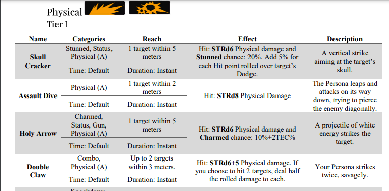
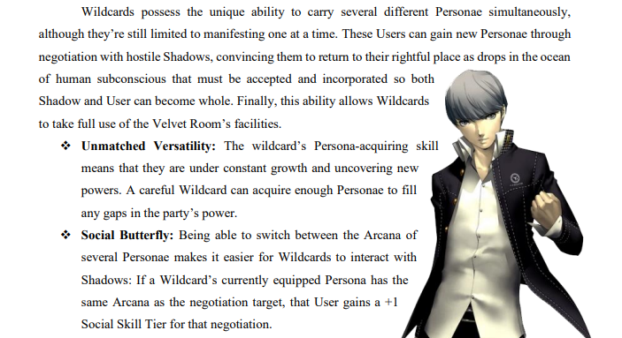
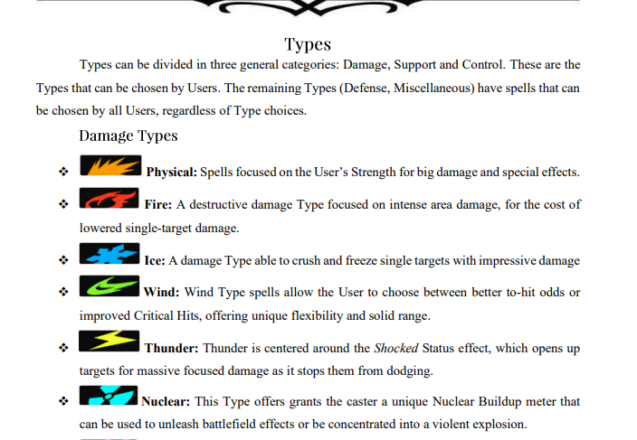
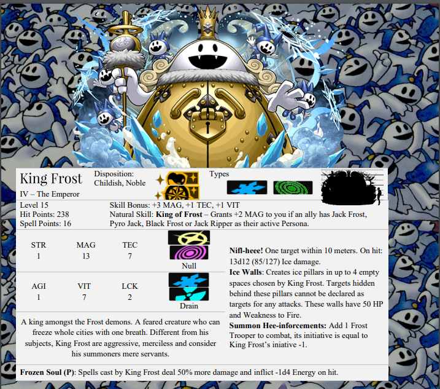
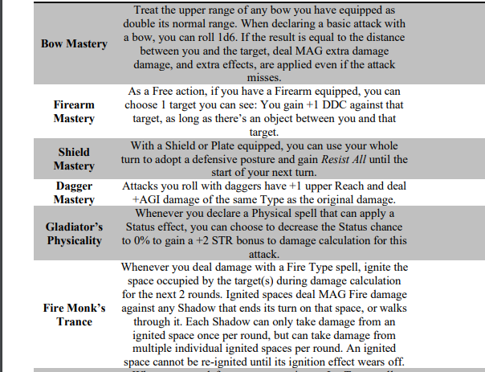
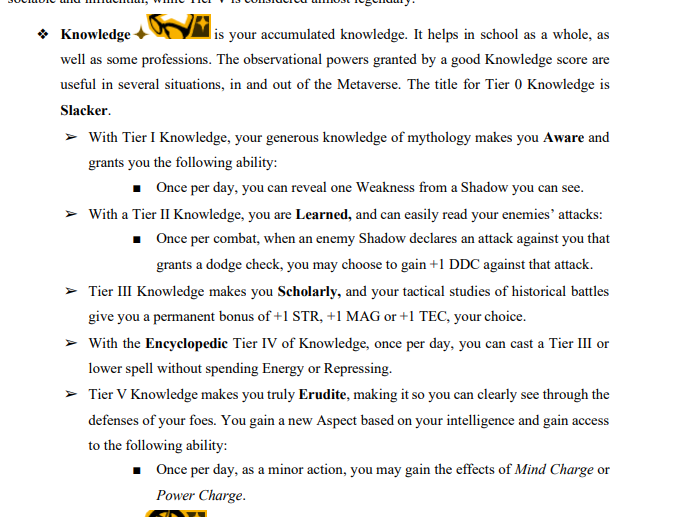

<link rel="shortcut icon" type="image/png" href="/_includes/favicon.ico">

# TRUTH LIES WITHIN
**Current Version:** 4.6.3 [Download Here](https://github.com/grimoireofheart/grimoireofheart.github.io/raw/main/Resources/Grimoire%20of%20the%20Heart%20[Core%20Rulebook].pdf)

**Sea Of Souls (Add-Ons and Bonus Content)**: [Download Here](https://github.com/grimoireofheart/grimoireofheart.github.io/tree/main/Resources/Sea%20of%20Souls%20(Add-Ons))

*Twitter: [@GrimoireOfHeart](twitter.com/GrimoireOfHeart)*  | *Join our [Discord](https://discord.com/invite/kDGnC4yqU6)!* | *[Homebrew Content](https://grimoireofheart.github.io/2022/06/22/Enter-the-Heartverse.html)*

Immerse yourself in a world built by human memories in the fully-featured RPG system inspired by the best-selling Persona series!

As a Persona User, you have the unique ability to dive into mankind’s subconsciousness, using it to uplift the weak and crush the wicked. What you’ll do with that power, and how you’ll spend your days in a scenic, modern Tokyo and beyond, is entirely up to you.

Whether you are brand new to tabletop games and the Persona series or a veteran of both, the Grimoire offers detailed explanations of its core mechanics to make sure anyone can enjoy the system to its fullest.

Contains all you need for a full game: rules, sheets, gear, enemies, and much more, in a richly illustrated love letter to the Persona franchise.

## Blog
August 26th: [Update 4.6.3](https://grimoireofheart.github.io/2022/08/26/Update-4.6.3.html)

Soul Hackers 2 releases today! To celebrate, check out the *Soul Hacker Handbook*, a supplement featuring more features for Devil Summoners, weapons, and powerful new enemies. Available [here](https://github.com/grimoireofheart/grimoireofheart.github.io/tree/main/Resources/Sea%20of%20Souls%20(Add-Ons)/Soul%20Hacker%20Handbook.pdf)

August 19th: [Update 4.6.2](https://grimoireofheart.github.io/2022/08/19/Update-4.6.2.html)

August 5th: [Update 4.6.1](https://grimoireofheart.github.io/2022/08/05/Update-4.6.1.html)

## Gallery

 

